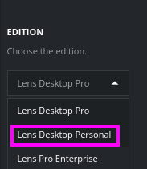

# 11 Apps <!-- omit in toc -->

# 1. Limpiar
```k
kubectl delete all --all
```

# 2. Opcional: KubeColor
>[Info](https://github.com/hidetatz/kubecolor)

El proyecto Kubecolor
```
sudo apt install kubecolor

echo alias kubectl="kubecolor" >> ~/.zshrc

k get pods -A
```

# 3. Lens

## 3.1. Ir a https://k8slens.dev/
## 3.2. Seleccionar la edición: Lens Desktop Personal

## 3.3. Crear una cuenta e instalar
## 3.4. Registrar .kube/config
### Crear un nuevo cluster y publicar el API
> [Cluster API](https://kind.sigs.k8s.io/docs/user/configuration/#api-server)

### 3.4.1. Copiar el config:
```vim
cd ~/.kube
cp config config.bak


cat ~/.kube/config
```

### 3.4.2. En le botón "+" - Add Clusters from Kubeconfig

### 3.4.3. Add Cluster

## 3.5. Comprobar nodos.

> Dar click en microk8s y en el menú lateral: Nodes

> Conditions: READY

# 4. Ver Opciones de objetos Kubernetes
- Ver Node
- Ver Workloads
- Ver Configuration
- Ver Network
- Ver Storage

# 5. Crear un recurso
New Tab (+) - Create Resource
Crear 1 recursos basandose en el archivo:
```yaml
apiVersion: apps/v1
kind: Deployment

metadata:
  name: myfrontend-deployment
  labels:
    app: mywebsite
    type: frontend

spec:
  replicas: 1

  template:
    metadata:
      name: myapp-pod
      labels:
        app: mywebsite
        type: frontend

    spec:
      containers:
        - name: nginx-container
          image: nginx

  selector:
    matchLabels:
      app: mywebsite
      type: frontend
```

# 6. Revisar la configuración del deployment **myfrontend-deployment** y escalar a 2 replicas.

# 7. Agregar Extensiones
File - Extensions
## 7.1. Cargar la extensión Resource Map: [lens-resource-map-extension](https://github.com/nevalla/lens-resource-map-extension)
> @nevalla/kube-resource-map

## 7.2. Ver resultados
Workloads - Overview


# 8. Opcional. Habilitar monitoreo

> Requridos 2GB de memoria para este laboratorio

Cluster Settings - Metrics:
Prometheus: Lens

Extensions - Lens Metrics, habilitar:
- Prometheus
- Enable bundled kube-state-metrics stack
- Node Exporter

Aplicar cambios

## 8.1. En el menu lateral ir a Cluster y ver métricas

Esta opción puede tardar varios minutos.

# 9. Opcional: Stern
>[Info](https://github.com/stern/stern)


